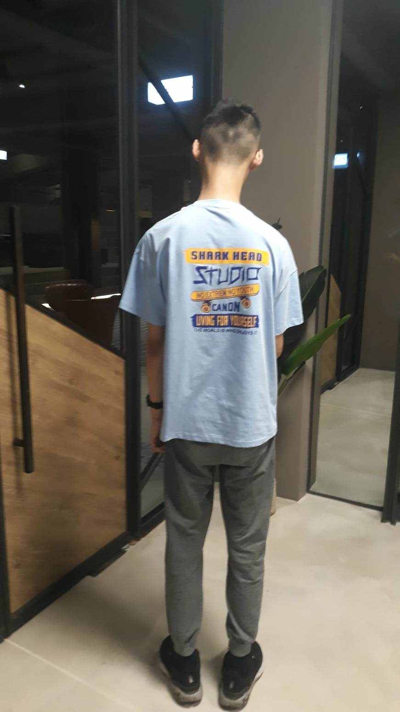
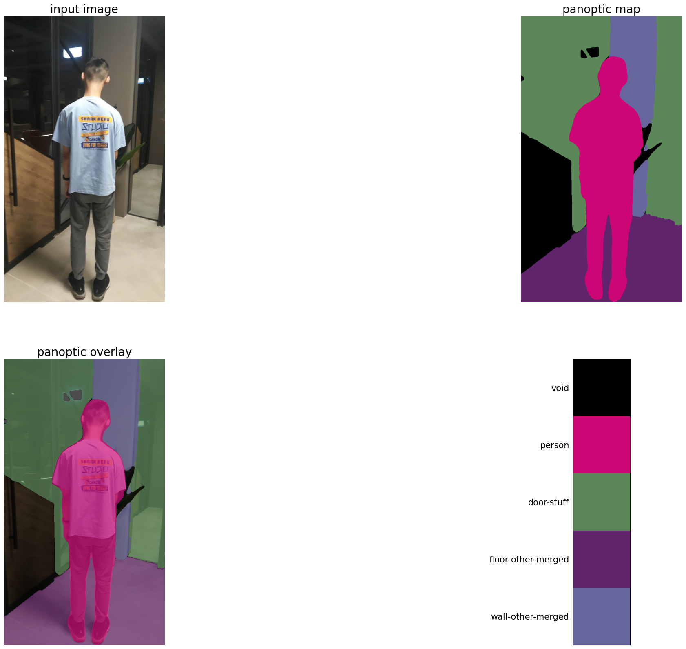
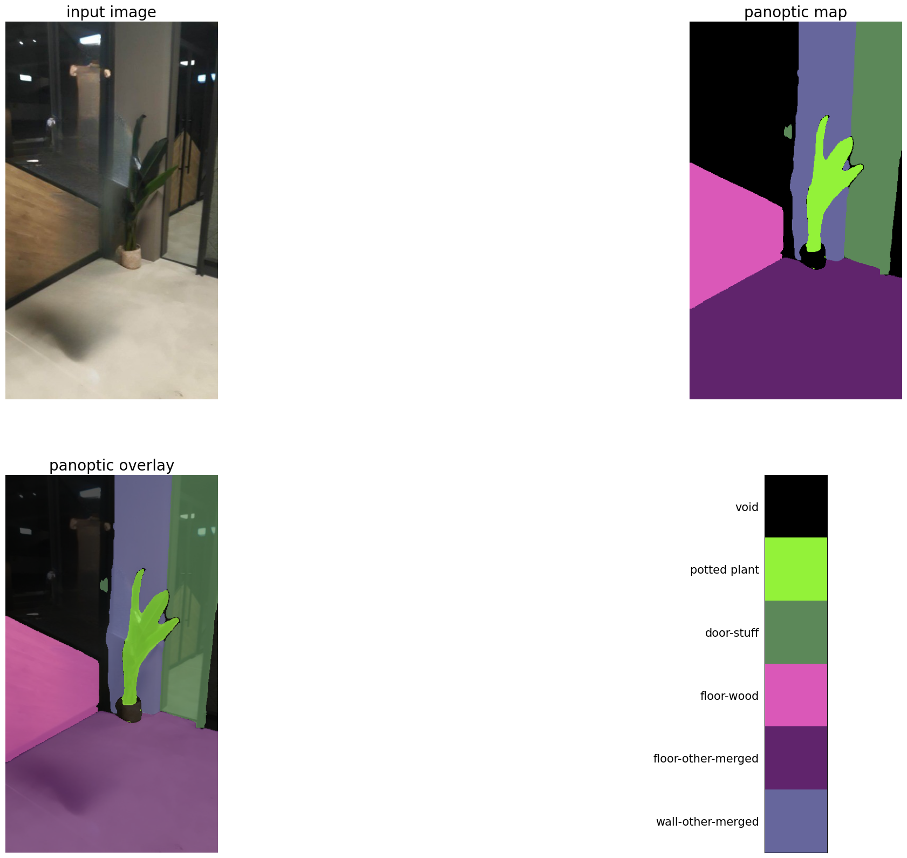
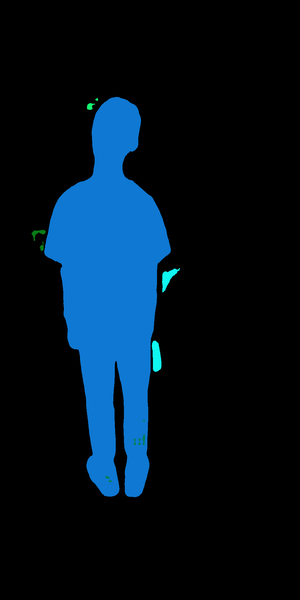
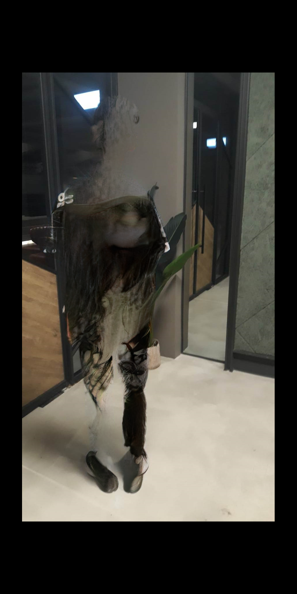
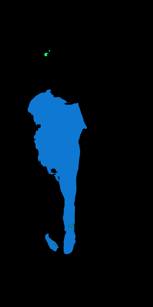

# 2023-AI-Final-Project
## Enhanced Image Segmentation with Iterative Image Inpainting

- [2023-AI-Final-Project](#2023-ai-final-project)
  - [Enhanced Image Segmentation with Iterative Image Inpainting](#enhanced-image-segmentation-with-iterative-image-inpainting)
    - [Installation](#installation)
    - [Intorduction](#intorduction)
    - [Related Works](#related-works)
    - [Dataset](#dataset)
    - [Baseline](#baseline)
    - [Main Approach](#main-approach)
    - [Evaluation metric](#evaluation-metric)
    - [Result \& Analysis](#result--analysis)
    - [References](#references)

### Installation

1. Clone [MAT](https://github.com/fenglinglwb/MAT/tree/main).
2. `pip install -r requirements.txt` for **MAT**.
3. Clone this repo.
4. Copy the files of this repo to the directory of **MAT**.
5. Run `python main.py`

### Intorduction

**Image segmentation** involves dividing an image into multiple regions or segments based on certain characteristics such as color, texture, or intensity. The purpose of segmentation is to simplify the representation of an image, making it easier to analyze and understand. It is a fundamental step in various computer vision tasks, including object detection, tracking, and recognition. 

**Image inpainting**, on the other hand, is a task of reconstructing missing regions in an image.

Both segmentation and inpainting are important tasks in the field of computer vision. However, for image segmentation, if an object is partially covered by other objects, it becomes challenging to achieve accurate segmentation. Therefore, after an image is segmented, we utilize the given mask to perform inpainting, and continue to segment it with the inpainted image. After inpainting, previously hidden objects are likely to be successfully segmented after a few iterations.
We use two models for inpainting and compare their performances. (MAT and LaMa)

### Related Works
- [Rethinking Atrous Convolution for Semantic Image Segmentation](https://arxiv.org/abs/1706.05587)
  - [DeepLabV3+](https://github.com/VainF/DeepLabV3Plus-Pytorch) (Github)
  - for image segmentation
- [MAT: Mask-Aware Transformer for Large Hole Image Inpainting](https://arxiv.org/abs/2203.15270)
  - [MAT](https://github.com/fenglinglwb/MAT/tree/main) (Github)
  - for image inpainting
- [LaMa: Resolution-robust Large Mask Inpainting with Fourier Convolutions](https://arxiv.org/abs/2109.07161)
  - [LaMa](https://github.com/advimman/lama) (Github)
  - another image inpainting model
- [Auto-Lama](https://github.com/andy971022/auto-lama)
  - combines object detection and image inpainting to automate object removal

### Dataset

- [The PASCAL Visual Object Classes](http://host.robots.ox.ac.uk:8080/pascal/VOC/?fbclid=IwAR0QFCOVrtALu7LmJBS0232L6t8Q0BNG98rhNHPkKdFLcoSAe9NHWapSLkk)
  - VOC 2012

We utilize the training/validation data (2GB) of VOC 2012, which contains more than 10,000 images and their labeling. The images in VOC2012 are typically smaller than 512*512. (We only use a small portion of this dataset, for testing.)

We also use some images taken on our own.

### Baseline

Our baseline is based on a pretrained model: deeplabv3_resnet101, provided by [pytorch](https://pytorch.org/hub/pytorch_vision_deeplabv3_resnet101/). The baseline model has been trained on a subset of COCO train2017, on the 20 categories that are present in the Pascal VOC dataset.

A Residual Neural Network (ResNet) is a deep learning model in which the weight layers learn residual functions with reference to the layer inputs.

### Main Approach


The main goal of our algorithm is to produce a **more-accurate image segmentation result**; the most important subroutines are: **ordinary image segmentation** and **image inpainting**. We iteratively call the subroutines several times to obtain the final result. 

The input of our algorithm is an image, and it outputs a mask, which is the result of segmentation. 

Below is the pseudo-code of our algorithm.

```py
procedure SegWithInpaint (
  img: input image, 
  Seg: segmentation subroutine, 
  Inp: inpaintingsubroutine, 
  Iter: number of iterations
)
1. M <- img
2. Initialize the BaseMask.
3. for iter in range(Iter); do
4.     mask <- Seg(M) # a mask is returned from Seg().
5.     M’ <- Inp(M, mask) # an inpainted image is returned from Inp().
6.     M <- M’
7.     BaseMask <- BaseMask & mask # combine masks
8. done
9. return BaseMask
end procedure
```

### Evaluation metric

**Qualitative**: 

We directly compare the segmentation results of DeepLabV3+ and that of our algorithm, through human’s eyes test: Check which one has detected more objects, accurately.

**Quantitative**:

We intend to use mIOU: Mean Intersection over Union as our quantitative metric, which is common in image segmentation literature.  However,  since our algorithm is not efficient enough, we fail to perform evalutation before the deadline of this project.

### Result & Analysis

**Original image**:


<!--  -->

**Baseline:**


<!--  -->

**Use LaMa to inpaint:**


<!--  -->

**Use MAT to inpaint:**

<table cellpadding="0" cellspacing="0" style="width: 100%;" border="0">
<tbody><tr>
<td>　　</td>
<td>　　</td>
<td>  </td>
</tr></tbody></table>
 
<!--  -->
<!--  -->
<!--  -->

### References

**Datasets**

- http://host.robots.ox.ac.uk:8080/eval/challenges/voc2010/
- https://github.com/open-mmlab/mmsegmentation/blob/master/docs/en/dataset_prepare.md#pascal-context

**Image Inpating**

- https://github.com/htzheng/CM-GAN-Inpainting?fbclid=IwAR22WpsLzkoIfn35e1P5rt_g4AqKN4xKrnpxWMgvEvh11CdHGf14E1aeiQU
- https://github.com/advimman/lama?fbclid=IwAR0wqTXkRKVTas-Qm--wUO04q3jDOL6WudrJb8rqKfINArUz1EKXtFeTUVE
- https://github.com/andy971022/auto-lama

**Image Segmentation**

- https://arxiv.org/pdf/1606.00915v2.pdf
- https://github.com/google-research/deeplab2
- https://github.com/VainF/DeepLabV3Plus-Pytorch
- https://pytorch.org/hub/pytorch_vision_deeplabv3_resnet101/
